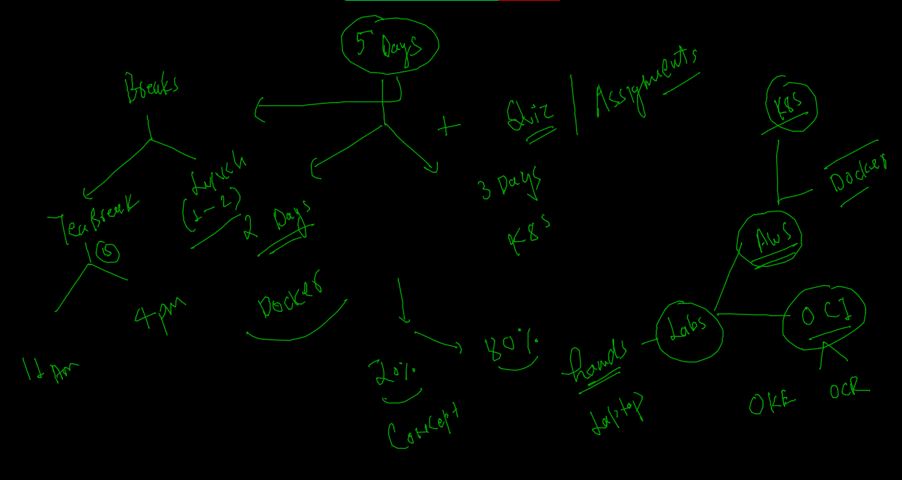
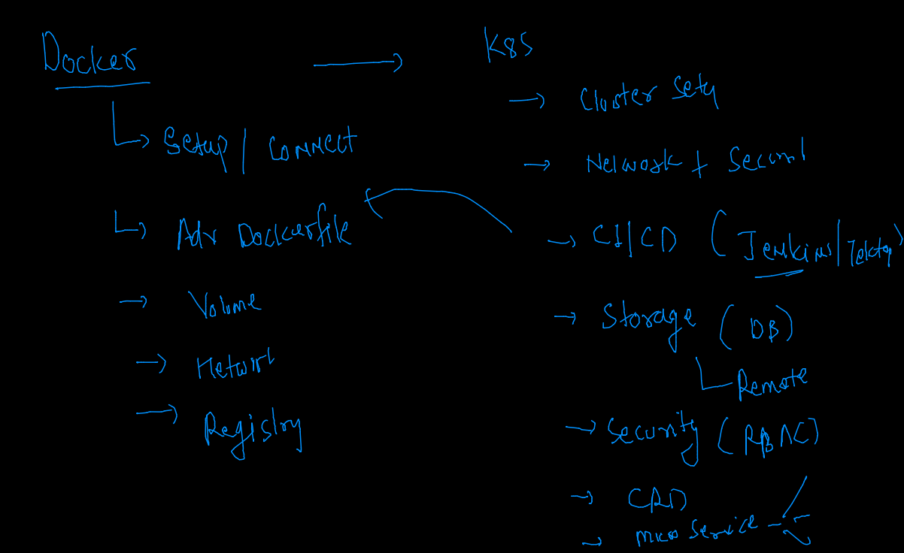
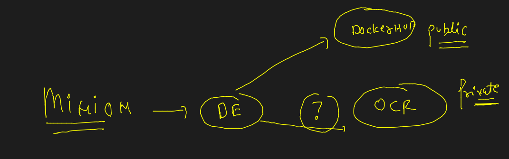
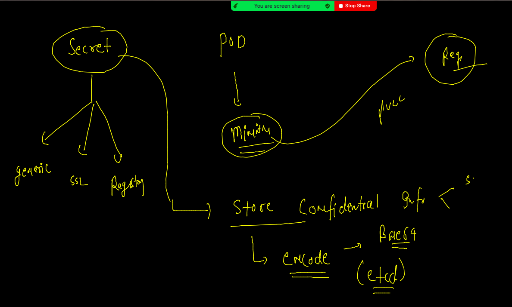
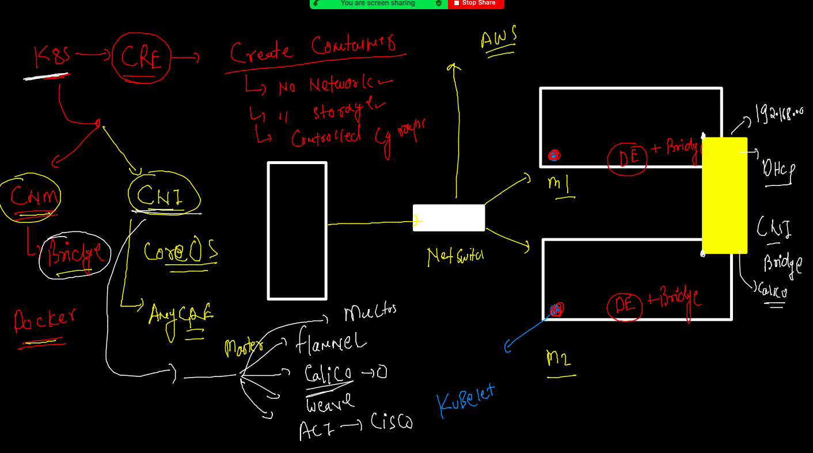
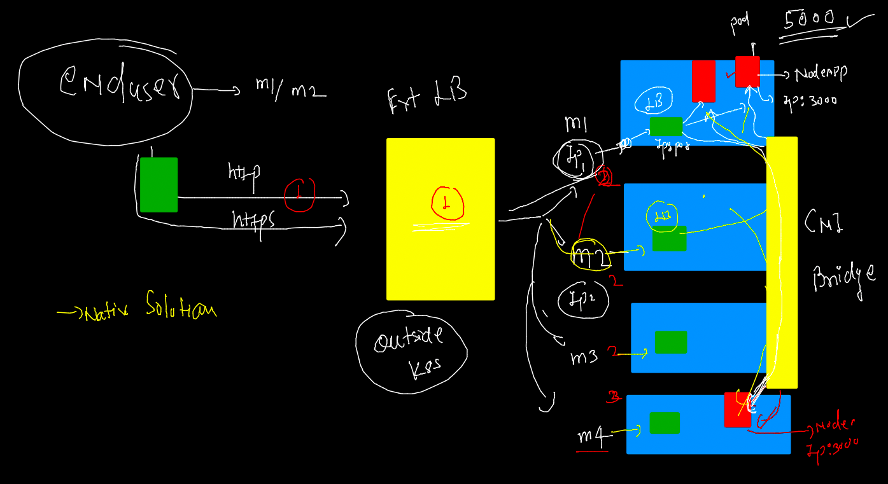
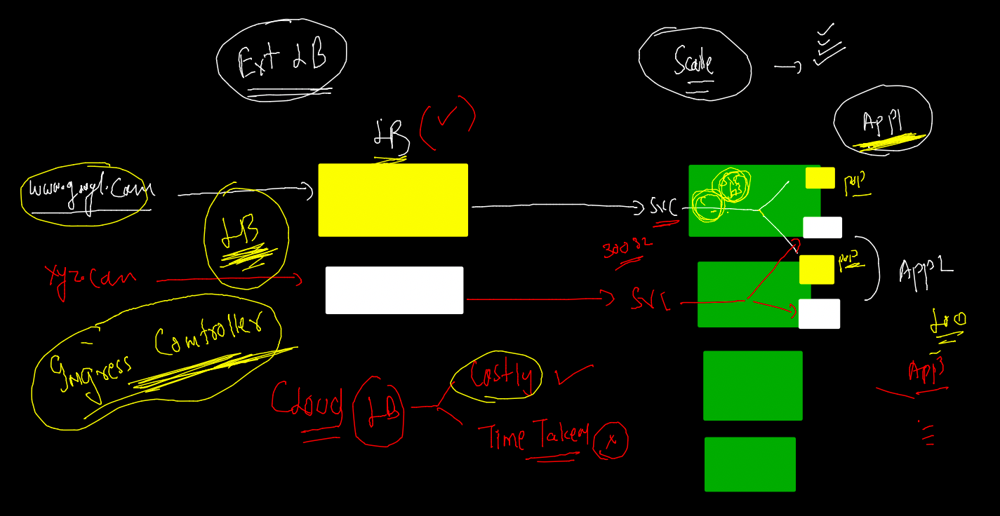

# Docker & Adv K8s

## Expectations 


### Plan 



### content 



## Deploy app from Private registry 



### OCIR image pod deploy 

```
kubectl  run  ashupodx1 --image=phx.ocir.io/axmbtg8judkl/alpine:v1   --command  ping localhost  --dry-run=client -o yaml  >ocirpod.yaml
kubectl  get  po
NAME        READY   STATUS             RESTARTS   AGE
ashupodx1   0/1     ImagePullBackOff   0          8m28

```

### Using secret to store Any private registry cred 



### creating secret 

```
kubectl  create  secret    
Create a secret using specified subcommand.

Available Commands:
  docker-registry Create a secret for use with a Docker registry
  generic         Create a secret from a local file, directory, or literal value
  tls             Create a TLS secret

```

### 

```
kubectl  create  secret docker-registry  ashuimgsec  --docker-server=phx.ocir.io  --docker-username=btg8judkl/learnteme@gmail.com  --docker-password="e+IHrda.sF4[6

```

### list secret
```
kubectl  get  secret
NAME                  TYPE                                  DATA   AGE
ashuimgsec            kubernetes.io/dockerconfigjson        1      63s
default-token-5c6l9   kubernetes.io/service-account-token   3      17h

```

### Deploy POD 

```
kubectl replace -f  ocirpod.yaml --force
pod "ashupodx1" deleted
pod/ashupodx1 replaced
 fire@ashutoshhs-MacBook-Air  ~/Desktop/k8sapps  kubectl get  po
NAME        READY   STATUS    RESTARTS   AGE
ashupodx1   1/1     Running   0          26s
 fire@ashutoshhs-MacBook-Air  ~/Desktop/k8sapps  
 
```
 
 ### Task 1 done 
 
 ```
 
 kubectl run  ashutoshhpod1  --image=busybox --command  ping fb.com  --namespace=tasks --dry-run=client -o yaml >task1.yaml 
 kubectl apply -f task1.yaml
 kubectl -n tasks ashutoshhpod1 -- sh
Error: flags cannot be placed before plugin name: -n
 ✘ fire@ashutoshhs-MacBook-Air  ~/Desktop/k8sapps  kubectl -n tasks exec -it  ashutoshhpod1 -- sh 
/ # 
/ # 
/ # ls
bin   dev   etc   home  proc  root  sys   tmp   usr   var
/ # mkdir  /opt
/ # ls
bin   dev   etc   home  opt   proc  root  sys   tmp   usr   var
/ # exit
 fire@ashutoshhs-MacBook-Air  ~/Desktop/k8sapps  ls
Limitrange.yaml ashupod1.yaml   logs.txt        ocirpod.yaml
ashupod.json    autogen.yaml    new.json        task1.yaml
 fire@ashutoshhs-MacBook-Air  ~/Desktop/k8sapps  kubectl -n tasks  cp  logs.txt  ashutoshhpod1:/opt/
 fire@ashutoshhs-MacBook-Air  ~/Desktop/k8sapps  kubectl -n tasks exec -it  ashutoshhpod1 -- sh / # cd /opt/
/opt # ls
logs.txt
/opt # echo minion2  >>logs.txt 
/opt # cat logs.txt 
PING fb.com (31.13.66.35): 56 data bytes
64 bytes from 31.13.66.35: seq=0 ttl=48 time=0.541 ms
64 bytes from 31.13.66.35: seq=1 ttl=48 time=0.564 ms
64 bytes from 31.13.66.35: seq=2 ttl=48 time=0.620 ms
64 bytes from 31.13.66.35: seq=3 ttl=48 time=0.597 ms
64 bytes from 31.13.66.35: seq=4 ttl=48 time=0.651 ms
64 bytes from 31.13.66.35: seq=5 ttl=48 time=0.568 ms
64 bytes from 31.13.66.35: seq=6 ttl=48 time=0.568 ms
64 bytes from 31.13.66.35: seq=7 ttl=48 time=0.621 ms
64 bytes from 31.13.66.35: seq=8 ttl=48 time=0.844 ms
64 bytes from 31.13.66.35: seq=9 ttl=48 time=0.584 ms
64 bytes from 31.13.66.35: seq=10 ttl=48 time=0.569 ms
64 bytes from 31.13.66.35: seq=11 ttl=48 time=0.580 ms
64 bytes from 31.13.66.35: seq=12 ttl=48 time=0.607 ms
64 bytes from 31.13.66.35: seq=13 ttl=48 time=0.584 ms
64 bytes from 31.13.66.35: seq=14 ttl=48 time=0.597 ms
64 bytes from 31.13.66.35: seq=15 ttl=48 time=0.554 ms
64 bytes from 31.13.66.35: seq=16 ttl=48 time=0.564 ms
64 bytes from 31.13.66.35: seq=17 ttl=48 time=0.563 ms
64 bytes from 31.13.66.35: seq=18 ttl=48 time=0.568 ms
64 bytes from 31.13.66.35: seq=19 ttl=48 time=0.605 ms
64 bytes from 31.13.66.35: seq=20 ttl=48 time=0.569 ms
64 bytes from 31.13.66.35: seq=21 ttl=48 time=0.568 ms
64 bytes from 31.13.66.35: seq=22 ttl=48 time=0.556 ms
64 bytes from 31.13.66.35: seq=23 ttl=48 time=0.599 ms
64 bytes from 31.13.66.35: seq=24 ttl=48 time=0.619 ms
64 bytes from 31.13.66.35: seq=25 ttl=48 time=0.565 ms
64 bytes from 31.13.66.35: seq=26 ttl=48 time=0.553 ms
64 bytes from 31.13.66.35: seq=27 ttl=48 time=0.566 ms
64 bytes from 31.13.66.35: seq=28 ttl=48 time=0.600 ms
64 bytes from 31.13.66.35: seq=29 ttl=48 time=0.557 ms
64 bytes from 31.13.66.35: seq=30 ttl=48 time=0.549 ms
minion2
/opt # exit

```

### K8s Networking -- 



### Deploy Node APP as POD 

```
kubectl run ashunode  --image=dockerashu/nodeapp:v1  --port 3000 --dry-run=client -o yaml  >nodeapp.yaml

```

### Deploy 

```
kubectl  apply -f  nodeapp.yaml 
pod/ashunode created
 fire@ashutoshhs-MacBook-Air  ~/Desktop/k8sapps  kubectl  get po -w
NAME       READY   STATUS              RESTARTS   AGE
ashunode   0/1     ContainerCreating   0          4s
ashunode   1/1     Running             0          26s
^C%                                                                                                   
 ✘ fire@ashutoshhs-MacBook-Air  ~/Desktop/k8sapps  kubectl  get po   
NAME       READY   STATUS    RESTARTS   AGE
ashunode   1/1     Running   0          34s
 fire@ashutoshhs-MacBook-Air  ~/Desktop/k8sapps  kubectl  get po -o wide
NAME       READY   STATUS    RESTARTS   AGE   IP              NODE      NOMINATED NODE   READINESS GATES
ashunode   1/1     Running   0          39s   192.168.34.61   minion1   <none>           <none>
 fire@ashutoshhs-MacBook-Air  ~/Desktop/k8sapps  

```

### access from Kubectl client side 

```
kubectl  port-forward  ashunode  1122:3000 
Forwarding from 127.0.0.1:1122 -> 3000
Forwarding from [::1]:1122 -> 3000
Handling connection for 1122
Handling connection for 1122
Handling connection for 1122
Handling connection for 1122

```

### Intro to Internal LB 



### create service 

```
kubectl  create  service
Create a service using a specified subcommand.

Aliases:
service, svc

Available Commands:
  clusterip    Create a ClusterIP service
  externalname Create an ExternalName service
  loadbalancer Create a LoadBalancer service
  nodeport     Create a NodePort service

```

### create NodePort service 

```
kubectl expose  pod  ashunode  --type NodePort --port  3000  --name  ashusvc1   --dry-run=client -o yaml 
apiVersion: v1
kind: Service
metadata:
  creationTimestamp: null
  labels:
    run: ashunode
  name: ashusvc1
spec:
  ports:
  - port: 3000
    protocol: TCP
    targetPort: 3000
  selector:
    run: ashunode
  type: NodePort
status:
  loadBalancer: {}
  
 ```
  
 ### checking service 
 
 ```
 kubectl expose  pod  ashunode  --type NodePort --port  3000  --name  ashusvc1   
Error from server (AlreadyExists): services "ashusvc1" already exists
 ✘ fire@ashutoshhs-MacBook-Air  ~/Desktop/k8sapps  kubectl  get service 
NAME       TYPE       CLUSTER-IP       EXTERNAL-IP   PORT(S)          AGE
ashusvc1   NodePort   10.104.252.123   <none>        3000:30505/TCP   18s
 
 ```

### Deployment creation 

```
kubectl  create  deployment  ashudep1  --image=dockerashu/nodeapp:v1   --dry-run=client  -o yaml   >ashudeploynode.yaml

```

### Deploy and check 

```
kubectl apply -f  ashudeploynode.yaml 
deployment.apps/ashudep1 created
 fire@ashutoshhs-MacBook-Air  ~/Desktop/k8sapps  kubectl  get  deployment 
NAME       READY   UP-TO-DATE   AVAILABLE   AGE
ashudep1   1/1     1            1           8s
 fire@ashutoshhs-MacBook-Air  ~/Desktop/k8sapps  kubectl  get po          
NAME                        READY   STATUS    RESTARTS   AGE
ashudep1-6f955cf7f6-wt7mc   1/1     Running   0          19s
 fire@ashutoshhs-MacBook-Air  ~/Desktop/k8sapps  
 fire@ashutoshhs-MacBook-Air  ~/Desktop/k8sapps  kubectl delete pod ashudep1-6f955cf7f6-wt7mc
pod "ashudep1-6f955cf7f6-wt7mc" deleted
 fire@ashutoshhs-MacBook-Air  ~/Desktop/k8sapps  kubectl  get po                             
NAME                        READY   STATUS    RESTARTS   AGE
ashudep1-6f955cf7f6-rts28   1/1     Running   0          6s

```

### exposing Deployment to create service 

```
kubectl  get deployment 
NAME       READY   UP-TO-DATE   AVAILABLE   AGE
ashudep1   1/1     1            1           4m54s
 fire@ashutoshhs-MacBook-Air  ~/Desktop/k8sapps  kubectl expose deployment ashudep1  --type NodePort --port  3000 --name  ashusvcx1  
service/ashusvcx1 exposed
 fire@ashutoshhs-MacBook-Air  ~/Desktop/k8sapps  kubectl get  svc
NAME        TYPE       CLUSTER-IP      EXTERNAL-IP   PORT(S)          AGE
ashusvcx1   NodePort   10.105.170.46   <none>        3000:30328/TCP   11s
 fire@ashutoshhs-MacBook-Air  ~/Desktop/k8sapps  


```

## Ingress Controller. 



### Multi app in k8s with LB 


### Solving problem using Ingress Controller 


### Deploy Ingress Controller in vm / bare-metal 

[docs](https://kubernetes.github.io/ingress-nginx/deploy/#bare-metal-clusters)

```
kubectl apply -f https://raw.githubusercontent.com/kubernetes/ingress-nginx/controller-v1.1.0/deploy/static/provider/baremetal/deploy.yaml
namespace/ingress-nginx created
serviceaccount/ingress-nginx created
configmap/ingress-nginx-controller created
clusterrole.rbac.authorization.k8s.io/ingress-nginx unchanged
clusterrolebinding.rbac.authorization.k8s.io/ingress-nginx unchanged
role.rbac.authorization.k8s.io/ingress-nginx created
rolebinding.rbac.authorization.k8s.io/ingress-nginx created
service/ingress-nginx-controller-admission created
service/ingress-nginx-controller created
deployment.apps/ingress-nginx-controller created
ingressclass.networking.k8s.io/nginx unchanged
validatingwebhookconfiguration.admissionregistration.k8s.io/ingress-nginx-admission configured
serviceaccount/ingress-nginx-admission created
clusterrole.rbac.authorization.k8s.io/ingress-nginx-admission unchanged
clusterrolebinding.rbac.authorization.k8s.io/ingress-nginx-admission unchanged
role.rbac.authorization.k8s.io/ingress-nginx-admission created
rolebinding.rbac.authorization.k8s.io/ingress-nginx-admission created
job.batch/ingress-nginx-admission-create created
job.batch/ingress-nginx-admission-patch created

```

### ingress check 

```
 kubectl get  deploy  -n ingress-nginx    
NAME                       READY   UP-TO-DATE   AVAILABLE   AGE
ingress-nginx-controller   1/1     1            1           2m31s
 fire@ashutoshhs-MacBook-Air  ~/Desktop/k8sapps  
 fire@ashutoshhs-MacBook-Air  ~/Desktop/k8sapps  
 fire@ashutoshhs-MacBook-Air  ~/Desktop/k8sapps  kubectl get  po -n ingress-nginx 
NAME                                        READY   STATUS      RESTARTS   AGE
ingress-nginx-admission-create-9pwsj        0/1     Completed   0          2m35s
ingress-nginx-admission-patch-j4kg7         0/1     Completed   0          2m34s
ingress-nginx-controller-84b9776df8-v7jj8   1/1     Running     0          2m39s
 fire@ashutoshhs-MacBook-Air  ~/Desktop/k8sapps  
 fire@ashutoshhs-MacBook-Air  ~/Desktop/k8sapps  kubectl get  svc -n ingress-nginx 
NAME                                 TYPE        CLUSTER-IP      EXTERNAL-IP   PORT(S)                      AGE
ingress-nginx-controller             NodePort    10.100.218.16   <none>        80:31928/TCP,443:32187/TCP   2m45s
ingress-nginx-controller-admission   ClusterIP   10.104.31.104   <none>        443/TCP                      2m46s
 fire@ashutoshhs-MacBook-Air  ~/Desktop/k8sapps  kubectl get  secret -n ingress-nginx 
NAME                                  TYPE                                  DATA   AGE
default-token-snpm8                   kubernetes.io/service-account-token   3      2m57s
ingress-nginx-admission               Opaque                                3      2m44s
ingress-nginx-admission-token-8wq9x   kubernetes.io/service-account-token   3      2m49s
ingress-nginx-token-59z6q             kubernetes.io/service-account-token   3      2m56s

```

### Two apps are running in k8s 

```
 
 fire@ashutoshhs-MacBook-Air  ~/Desktop/k8sapps  kubectl  create deployment   customer1app --image=dockerashu/ashuimages:dec14v1

deployment.apps/customer1app created
 fire@ashutoshhs-MacBook-Air  ~/Desktop/k8sapps  kubectl  get  deploy
NAME           READY   UP-TO-DATE   AVAILABLE   AGE
ashudep1       2/2     2            2           52m
customer1app   1/1     1            1           5s
 fire@ashutoshhs-MacBook-Air  ~/Desktop/k8sapps  kubectl  expose  deploy  customer1app  --port 3000 --name customersvc
service/customersvc exposed
 fire@ashutoshhs-MacBook-Air  ~/Desktop/k8sapps  kubectl get  svc
NAME          TYPE        CLUSTER-IP      EXTERNAL-IP   PORT(S)    AGE
ashusvc       ClusterIP   10.97.3.219     <none>        3000/TCP   2m12s
customersvc   ClusterIP   10.109.53.234   <none>        3000/TCP   5s
 fire@ashutoshhs-MacBook-Air  ~/Desktop/k8sapps  kubectl  expose  deploy  customer1app  --port 80 --name customersvc1
service/customersvc1 exposed
 fire@ashutoshhs-MacBook-Air  ~/Desktop/k8sapps  kubectl delete svc customersvc
service "customersvc" deleted

```

