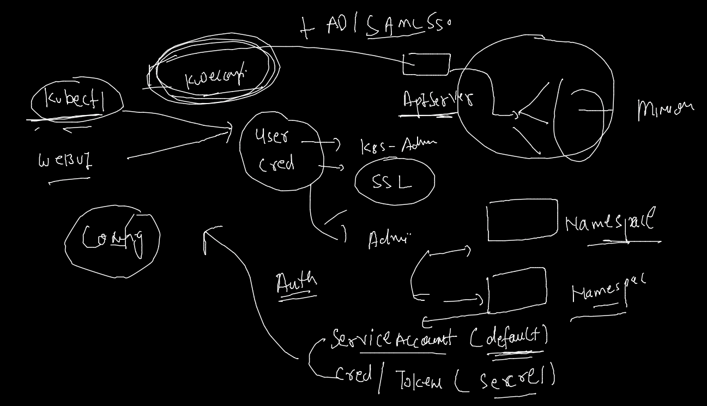
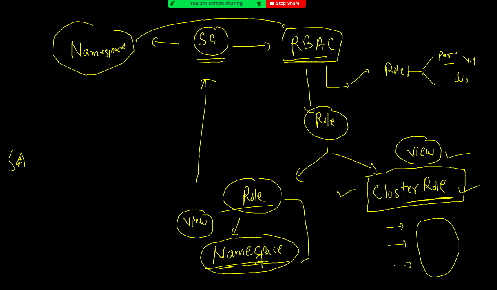
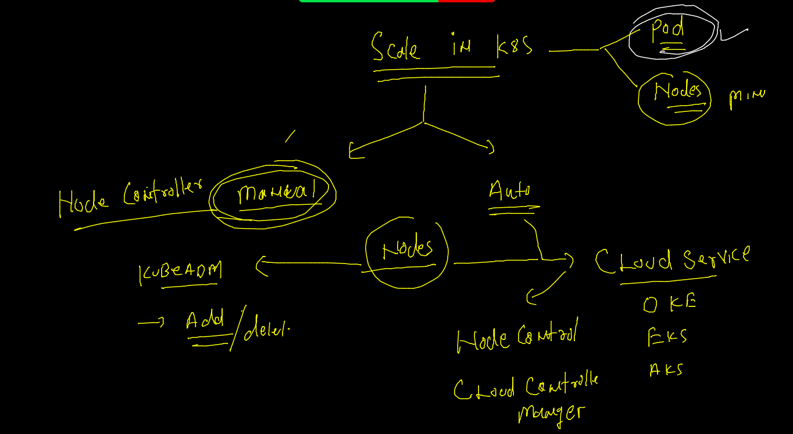
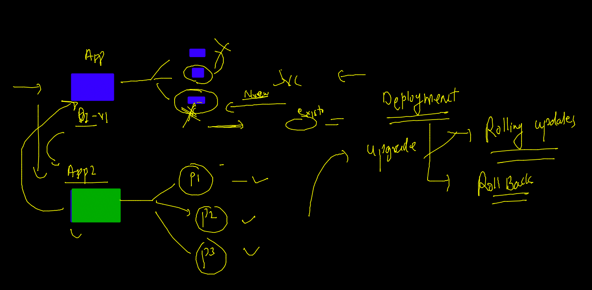
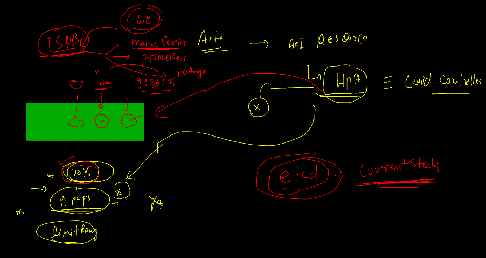
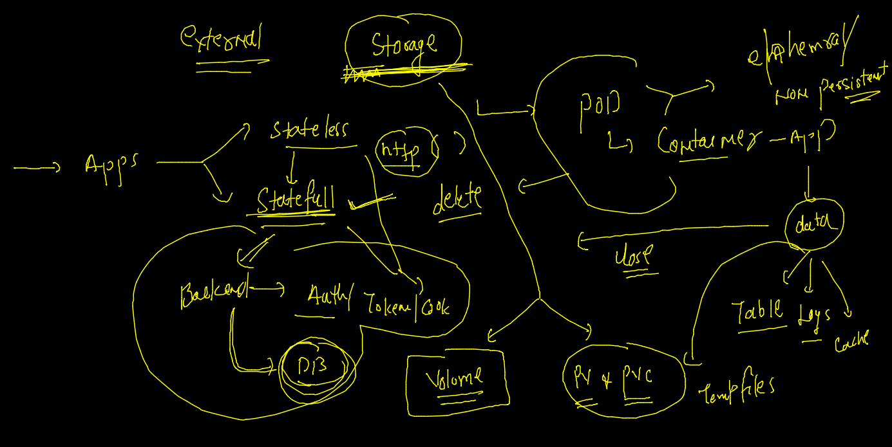

# Docker & Adv K8s

## Expectations 


### Plan 


### content 


### Install kubectl link 

[link](https://kubernetes.io/docs/tasks/tools/)

### k8s dashboard Deployment 

[GithubLInk](https://github.com/kubernetes/dashboard)

```
kubectl apply -f https://raw.githubusercontent.com/kubernetes/dashboard/v2.4.0/aio/deploy/recommended.yaml
namespace/kubernetes-dashboard created
serviceaccount/kubernetes-dashboard created
service/kubernetes-dashboard created
sec

```

### service account bounded with namespace 



### auth token for k8s dashboard checking 

```
kubectl  get  sa  -n kubernetes-dashboard
NAME                   SECRETS   AGE
default                1         13m
kubernetes-dashboard   1         13m
 fire@ashutoshhs-MacBook-Air  ~  
 fire@ashutoshhs-MacBook-Air  ~  kubectl  get  secret  -n kubernetes-dashboard
NAME                               TYPE                                  DATA   AGE
default-token-m5z5x                kubernetes.io/service-account-token   3      13m
kubernetes-dashboard-certs         Opaque                                0      13m
kubernetes-dashboard-csrf          Opaque                                1      13m
kubernetes-dashboard-key-holder    Opaque                                2      13m
kubernetes-dashboard-token-d6tjk   kubernetes.io/service-account-token   3      13m

```

### changing service type 

```
kubectl edit svc  kubernetes-dashboard  -n kubernetes-dashboard

```
### ROles and clusterrole in k8s 



### give access to sa of kubernetes-dashboard 

```
kubectl  create  clusterrolebinding  defaultsabind  --clusterrole=cluster-admin   --serviceaccount=kubernetes-dashboard:kubernetes-dashbard

```

### Deploy web app 

```
kubectl  create  deployment  ashuweb --image=dockerashu/httpapps:v1  --dry-run=client -o yaml  >web.yaml

```

### Scaling in k8s 



### Manual scaling 

```
kubectl  scale deployment  ashuweb  --replicas=3
deployment.apps/ashuweb scaled
 fire@ashutoshhs-MacBook-Air  ~  
 fire@ashutoshhs-MacBook-Air  ~  
 fire@ashutoshhs-MacBook-Air  ~  kubectl  get  po                                
NAME                       READY   STATUS              RESTARTS   AGE
ashuweb-55b459bdff-gqf2w   1/1     Running             0          37m
ashuweb-55b459bdff-nvnzf   0/1     ContainerCreating   0          2s
ashuweb-55b459bdff-pr6vw   0/1     ContainerCreating   0          2s

```

### checking deploy things 

```
kubectl  describe deploy  ashuweb
Name:                   ashuweb
Namespace:              ashu-project
CreationTimestamp:      Fri, 17 Dec 2021 11:14:09 +0530
Labels:                 app=ashuweb
Annotations:            deployment.kubernetes.io/revision: 1
Selector:               app=ashuweb
Replicas:               2 desired | 2 updated | 2 total | 2 available | 0 unavailable
StrategyType:           RollingUpdate
MinReadySeconds:        0
RollingUpdateStrategy:  25% max unavailable, 25% max surge
Pod Template:
  Labels:  app=ashuweb
  Containers:


```

### deployment strategy 



### rolling update / rollout in deployment of k8s 

```
 9223  kubectl set  image  deployment  ashuweb  httpapps=dockerashu/httpapps:v2
 9224  kubectl  get  po 
 9225  kubectl  describe deploy  ashuweb  
 fire@ashutoshhs-MacBook-Air  ~  
 fire@ashutoshhs-MacBook-Air  ~  
 fire@ashutoshhs-MacBook-Air  ~  kubectl  rollout history deploy  ashuweb
deployment.apps/ashuweb 
REVISION  CHANGE-CAUSE
1         <none>
2         <none>

 fire@ashutoshhs-MacBook-Air  ~  kubectl  rollout status deploy  ashuweb
deployment "ashuweb" successfully rolled out
 fire@ashutoshhs-MacBook-Air  ~  
 fire@ashutoshhs-MacBook-Air  ~  
 fire@ashutoshhs-MacBook-Air  ~  kubectl  rollout undo  deploy  ashuweb
deployment.apps/ashuweb rolled back
 fire@ashutoshhs-MacBook-Air  ~  kubectl get  po 
NAME                       READY   STATUS        RESTARTS   AGE
ashuweb-55b459bdff-bpngz   1/1     Running       0          5s
ashuweb-55b459bdff-sdqq9   1/1     Running       0          3s
ashuweb-74b9df768-5b2xb    1/1     Terminating   0          114s
ashuweb-74b9df768-rg74q    1/1     Terminating   0          110s

```

### HPA 



### HPA 

```
kubectl  autoscale  deployment  ashuweb --min=3  --max=20 --cpu-percent=80 
horizontalpodautoscaler.autoscaling/ashuweb autoscaledp
 fire@ashutoshhs-MacBook-Air  ~  
 fire@ashutoshhs-MacBook-Air  ~  
 fire@ashutoshhs-MacBook-Air  ~  kubectl  get hpa
NAME      REFERENCE            TARGETS         MINPODS   MAXPODS   REPLICAS   AGE
ashuweb   Deployment/ashuweb   <unknown>/80%   3         20        0          8s
 fire@ashutoshhs-MacBook-Air  ~  
 fire@ashutoshhs-MacBook-Air  ~  
 fire@ashutoshhs-MacBook-Air  ~  kubectl  get  deploy                                                       
NAME      READY   UP-TO-DATE   AVAILABLE   AGE
ashuweb   2/3     3            2           83m
 fire@ashutoshhs-MacBook-Air  ~  kubectl  get  deploy 
NAME      READY   UP-TO-DATE   AVAILABLE   AGE
ashuweb   3/3     3            3           83m

```

### K8s app deployment with Storage 



### k8s volume type list 

[List](https://kubernetes.io/docs/concepts/storage/volumes/)

### two tier app deployment 

### Storage in k8s 
## PV 

```
apiVersion: v1
kind: PersistentVolume
metadata:
 name: ashupv1 # this is namespace independent 
  # this job done by Storage engg team 
spec: 
 capacity: 
  storage: 4Gi # 2Gi , 3Gi , 1Gi , 1--- 7Gi 
 accessModes: # permission in storage 
  - ReadWriteMany # RWO , RWM , ROM (ReadWriteOnce)
 nfs: # source of storage which is external NFS 
  path: /common/ashu # Location on NFS server
  server: 172.31.95.144 # ip address of NFS 
 storageClassName: fast # slow , veryfast , veryslow

```

### deploy pv 

```
kubectl apply -f  ashupv.yaml 
persistentvolume/ashupv1 created
 fire@ashutoshhs-MacBook-Air  ~/Desktop/k8sapps/appdb  kubectl get pv
NAME      CAPACITY   ACCESS MODES   RECLAIM POLICY   STATUS      CLAIM   STORAGECLASS   REASON   AGE
ashupv1   4Gi        RWX            Retain           Available

```

### Deploy PVC 

```
apiVersion: v1
kind: PersistentVolumeClaim
metadata:
 name: ashupvc111 
spec:
 storageClassName: slow
 accessModes: 
 - ReadWriteOnce
 resources:
  requests:
   storage: 2Gi 

```


====

```
 kubectl apply -f  ashupvc.yaml
persistentvolumeclaim/ashupvc111 created
 fire@ashutoshhs-MacBook-Air  ~/Desktop/k8sapps/appdb  kubectl  get pvc
NAME         STATUS   VOLUME    CAPACITY   ACCESS MODES   STORAGECLASS   AGE
ashupvc111   Bound    venupv1   2Gi        RWO            slow           7s

```

## FOR DB deployment 

### Mysql:5.6 

### creating secret for root password storage 
```
kubectl  create secret generic  ashudbsec  --from-literal  sqlpass=Oracledb088        --dry-run=client  -o yaml 
apiVersion: v1
data:
  sqlpass: T3JhY2xlZGIwODg=
kind: Secret
metadata:
  creationTimestamp: null
  name: ashudbsec

```

### Deploy Db 

```
 ls
ashupv.yaml  ashupvc.yaml db.yaml
 fire@ashutoshhs-MacBook-Air  ~/Desktop/k8sapps/appdb  kubectl apply -f db.yaml 
deployment.apps/ashudb created
secret/ashudbsec created
 fire@ashutoshhs-MacBook-Air  ~/Desktop/k8sapps/appdb  kubectl get deploy
NAME     READY   UP-TO-DATE   AVAILABLE   AGE
ashudb   1/1     1            1           15s
 fire@ashutoshhs-MacBook-Air  ~/Desktop/k8sapps/appdb  kubectl get secret
NAME                  TYPE                                  DATA   AGE
ashudbsec             Opaque                                1      19s

```


### create service for db 

```
kubectl expose deployment  ashudb  --type ClusterIP  --port 3306  --dry-run=client -o yaml 
apiVersion: v1
kind: Service
metadata:
  creationTimestamp: null
  labels:
    app: ashudb
  name: ashudb
spec:
  ports:
  - port: 3306
    protocol: TCP
    targetPort: 3306
  selector:
    app: ashudb
  type: ClusterIP
status:
  loadBalancer: {}

```

