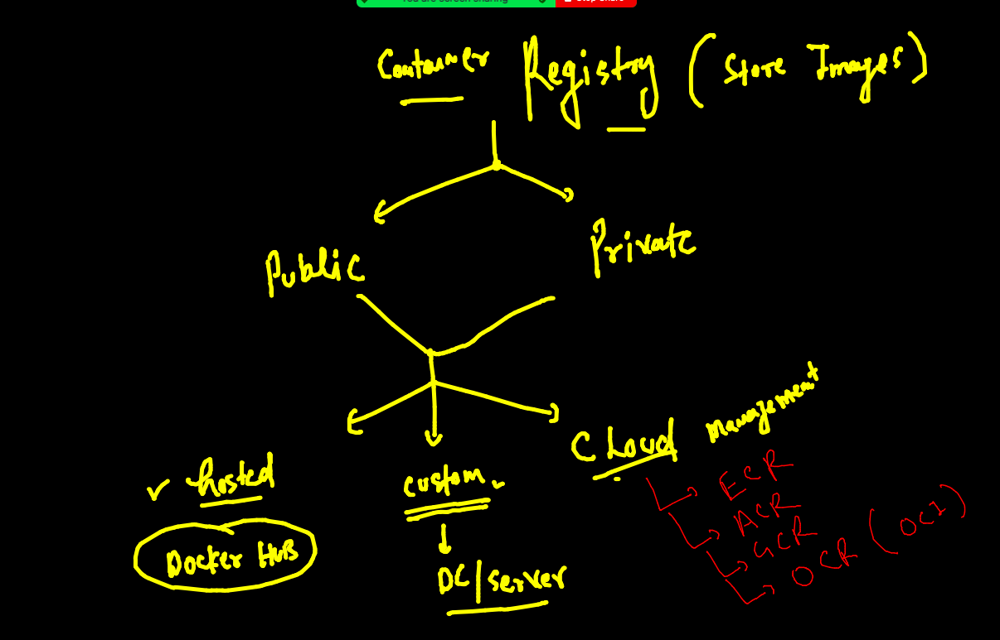
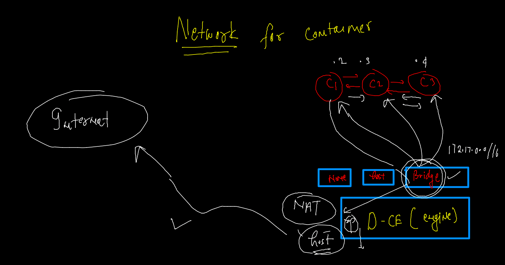
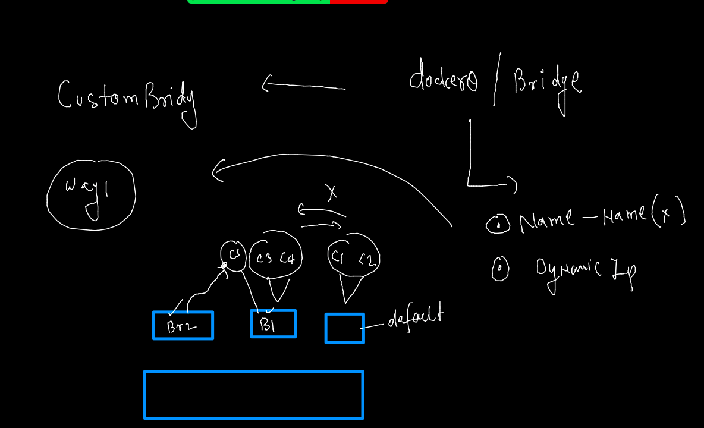

# Docker & Adv K8s

## Expectations 


### Plan 


### content 


## Registry 



### opensource options to host docker registry 

[REgistry](https://goharbor.io/)

### Image name reality 

```
docker pull oraclelinux:8.4        
8.4: Pulling from library/oraclelinux
a4df6f21af84: Pull complete 
Digest: sha256:b81d5b0638bb67030b207d28586d0e714a811cc612396dbe3410db406998b3ad
Status: Downloaded newer image for oraclelinux:8.4
docker.io/library/oraclelinux:8.4

```

### pulling image from other registry 

```
docker pull quay.io/bitnami/nginx

```

## pushing image to docker hub 

### step 1 tagging 

```
docker  tag  ashuhttpd:dec13app1   docker.io/dockerashu/ashuimages:dec14v1 
```

### step 2 login 

```
docker login  
Login with your Docker ID to push and pull images from Docker Hub. If you don't have a Docker ID, head over to https://hub.docker.com to create one.
Username: dockerashu
Password: 
Login Succeeded

```

### step 3 

```
docker push  docker.io/dockerashu/ashuimages:dec14v1
The push refers to repository [docker.io/dockerashu/ashuimages]
afabf63ee6a0: Pushed 
62e999172f36: Pushed 
c029303805d7: Mounted from library/oraclelinux 
dec14v1: digest: sha256:0fa34296d50a47b827b768c44eaf9c17344704f8d6e44014da51d8b271f511c1 size: 952
```

### step 4 (optional)

```
docker logout 
Removing login credentials for https://index.docker.io/v1/
```


## ANy one can pull this public repo image 

```
docker pull dockerashu/ashuimages:dec14v1

dec14v1: Pulling from dockerashu/ashuimages
b791d4160c6a: Already exists 
096f3738e919: Downloading [>                                                  ]  1.063MB/115.8MB
cf87065a7d2e: Downloading [=============>                                     ]  128.9kB/480.3kB

```

## Pushing image to OCR 


### tagging 

```
docker  tag  ashuhttpd:dec13app1   phx.ocir.io/axmbtg8judkl/httpdapp:v1
```

### login 

```
docker login  phx.ocir.io   
Username: axmbtg8judkl/learntechbyme@gmail.com
Password: 
Login Succeeded


```

### pushing image

```
docker push  phx.ocir.io/axmbtg8judkl/httpdapp:v1
The push refers to repository [phx.ocir.io/axmbtg8judkl/httpdapp]
afabf63ee6a0: Pushed 
62e999172f36: Pushing [==========================================>        ]    140MB/163.1MB
c029303805d7: Pu
```

### optional step 

```
docker  logout   phx.ocir.io
Removing login credentials for phx.ocir.io

```

### building python script based image 

```
cd pythonscript 
 fire@ashutoshhs-MacBook-Air  ~/Desktop/dockerimages/pythonscript  ls
Dockerfile hello.py
 fire@ashutoshhs-MacBook-Air  ~/Desktop/dockerimages/pythonscript  docker build -t ashupython:v1  . 
[+] Building 11.7s (4/8)                                                                                  
 => [internal] load build definition from Dockerfile                                                 0.2s
 => => transferring dockerfile: 379B                                                                 0.0s
 => [internal] load .dockerignore                                                                    0.1s
 => => transferring context: 2B                                  
 
```

### creating container 
```
docker  run -it -d --name  ashuc1   ashupython:v1 
f48fd1a05e565694ee5cc603c410ee4ad7314da0c1d2c78c3092d89c004d9c3d
 fire@ashutoshhs-MacBook-Air  ~  docker  ps
CONTAINER ID   IMAGE           COMMAND             CREATED          STATUS         PORTS     NAMES
f48fd1a05e56   ashupython:v1   "python hello.py"   12 seconds ago   Up 6 seconds             ashuc1
 fire@ashutoshhs-MacBook-Air  ~  

```

### container with loggin options 

### to check log driver using -- docker info command 

```
8483  docker  run -it -d --name  ashuc2  --log-driver syslog  --log-opt syslog-address=udp://172.31.95.144:514    ashupython:v1
 fire@ashutoshhs-MacBook-Air  ~  docker ps
CONTAINER ID   IMAGE             COMMAND             CREATED         STATUS         PORTS     NAMES
61278cde1434   ashupython:v1     "python hello.py"   8 seconds ago   Up 5 seconds             ashuc2
7e1b1b92a716   venupython:v1     "python code.py"    5 minutes ago   Up 5 minutes             venupythonc1
5ecb732de9a5   anilpython:v1     "python hello.py"   5 minutes ago   Up 5 minutes             anilc1
6f5a677e3fa5   ashupython:v1     "python hello.py"   5 minutes ago   Up 5 minutes             kuldeep
50ef7e63bc24   kiranapython:v1   "python hello.py"   6 minutes ago   Up 6 minutes             k_python
ab2e0a2e9d08   harikapyi:v11     "python hello.py"   7 minutes ago   Up 7 minutes             harikapyc
f48fd1a05e56   ashupython:v1     "python hello.py"   7 minutes ago   Up 7 minutes             ashuc1
 fire@ashutoshhs-MacBook-Air  ~  docker logs -f  ashuc2
Hello all , welcome to python..!!
Welcome to LnB..
Welcome to Containers ..!!
______________________
Hello all , welcome to python..!!
Welcome to LnB..
Welcome to Containers ..!!
______________________
Hello all , welcome to python..!!
Welcome to LnB..
Welcome to Containers ..!!
______________________

```

### Docker container loggin with syslog 

[Docs](https://docs.docker.com/config/containers/logging/syslog/)

### configure docker engine to send logs to syslog 

```
[root@ip-172-31-82-225 docker]# pwd
/etc/docker
[root@ip-172-31-82-225 docker]# vim  daemon.json 
[root@ip-172-31-82-225 docker]# cat  daemon.json 
{
  "log-driver": "syslog",
  "log-opts": {
    "syslog-address": "udp://172.31.95.144:514"
  }
}
[root@ip-172-31-82-225 docker]# systemctl daemon-reload 
[root@ip-172-31-82-225 docker]# systemctl restart docker

```

###  restart policy in containers

[link](https://docs.docker.com/config/containers/start-containers-automatically/)

### checking default restart policy for container 

```
docker inspect  ashuc2 --format='{{.Id}}'
61278cde143415fb3451ce13caeb8b84187c098ac4e193b1e9dbcaac5fdf3597
 fire@ashutoshhs-MacBook-Air  ~  docker inspect  ashuc2 --format='{{.State.Status}}'
exited
 fire@ashutoshhs-MacBook-Air  ~  docker inspect  ashuc2 --format='{{.HostConfig.RestartPolicy.Name}}'
no
 fire@ashutoshhs-MacBook-Air  ~  

```

### changing / setting restart policy of container 


```
 fire@ashutoshhs-MacBook-Air  ~  docker run -tid --name ashuc3  --restart  always  ashupython:v1  
58c4f2653f2ad44ab8a992620c151f4f27d8490bcf8d4d97daae5bc4b0ec3014
 fire@ashutoshhs-MacBook-Air  ~  docker ps
CONTAINER ID   IMAGE           COMMAND             CREATED         STATUS         PORTS     NAMES
58c4f2653f2a   ashupython:v1   "python hello.py"   5 seconds ago   Up 2 seconds             ashuc3
 fire@ashutoshhs-MacBook-Air  ~  docker inspect  ashuc3 --format='{{.HostConfig.RestartPolicy.Name}}'
always
 fire@ashutoshhs-MacBook-Air  ~  
 fire@ashutoshhs-MacBook-Air  ~  
 fire@ashutoshhs-MacBook-Air  ~  docker update   ashuc2  --restart=always 
ashuc2
 fire@ashutoshhs-MacBook-Air  ~  
 fire@ashutoshhs-MacBook-Air  ~  docker inspect  ashuc2 --format='{{.HostConfig.RestartPolicy.Name}}'
always
 fire@ashutoshhs-MacBook-Air  ~  


```

### docker file for python 

```
 ls
Dockerfile        hello.py          oracle.dockerfile
 fire@ashutoshhs-MacBook-Air  ~/Desktop/dockerimages/pythonscript  docker build -t ashupython:v2 -f oracle.dockerfile   . 
Sending build context to Docker daemon  4.096kB
Step 1/7 : FROM oraclelinux:8.5
 ---> fa4253e97227
Step 2/7 : LABEL name="ashutoshh"
 ---> Using cache
 ---> 3d8cde119650
Step 3/7 : RUN yum install python3 -y
 ---> Running in 3fc1ed250aa9
Oracle Linux 8 BaseOS Latest (x86_64)            94 MB/s |  40 MB     00:

```

### Java sprint boot sample app -- Multi stage dockerfile 

```
git clone https://github.com/redashu/java-springboot.git
Cloning into 'java-springboot'...
remote: Enumerating objects: 23, done.
remote: Counting objects: 100% (23/23), done.
remote: Compressing objects: 100% (17/17), done.
remote: Total 23 (delta 4), reused 0 (delta 0), pack-reused 0
Unpacking objects: 100% (23/23), 5.60 KiB | 127.00 KiB/s, done.
 fire@ashutoshhs-MacBook-Air  ~/Desktop/dockerimages  ls                                            
java-springboot      project-html-website pythonscript
 fire@ashutoshhs-MacBook-Air  ~/Desktop/dockerimages  
 
 ===
 
```

### Docker networking 

### Existing network 

```
docker network  ls
NETWORK ID     NAME      DRIVER    SCOPE
35a9948cb45a   bridge    bridge    local
9783c391ff70   host      host      local
c474c3eeb91b   none      null      local
 fire@ashutoshhs-MacBook-Air  ~  

```

### No network container 

```
docker run -it --rm  --network none  alpine  sh  
/ # uname 
Linux
/ # uname -r
4.14.252-195.483.amzn2.x86_64
/ # cat /etc/os-release 
NAME="Alpine Linux"
ID=alpine
VERSION_ID=3.15.0
PRETTY_NAME="Alpine Linux v3.15"
HOME_URL="https://alpinelinux.org/"
BUG_REPORT_URL="https://bugs.alpinelinux.org/"
/ # ls 
bin    dev    etc    home   lib    media  mnt    opt    proc   root   run    sbin   srv    sys    tmp    usr    var
/ # ping  google.com 
ping: bad address 'google.com'
/ # ^C
/ # ifconfig 
lo        Link encap:Local Loopback  
          inet addr:127.0.0.1  Mask:255.0.0.0
          UP LOOPBACK RUNNING  MTU:65536  Metric:1
          RX packets:0 errors:0 dropped:0 overruns:0 frame:0
          TX packets:0 errors:0 dropped:0 overruns:0 carrier:0
          collisions:0 txqueuelen:1000 
          RX bytes:0 (0.0 B)  TX bytes:0 (0.0 B)

/ # exit

```

### container with host bridge 

```
 docker run -it --rm --network host alpine sh
```

### Default bridge for all containers 

```
docker network  inspect  bridge
[
    {
        "Name": "bridge",
        "Id": "35a9948cb45a9f8d9393ace7a8d61764ee9dd3d8933e2ade23e054834ce91dce",
        "Created": "2021-12-14T06:38:59.654560147Z",
        "Scope": "local",
        "Driver": "bridge",
        "EnableIPv6": false,
        "IPAM": {
            "Driver": "default",
            "Options": null,
            "Config": [
                {
                    "Subnet": "172.17.0.0/16",
                    "Gateway": "172.17.0.1"
                }
            ]
```

### default network bridge 

```
 docker run -itd --name c1  alpine 
57b817bfff52e0f38d0cf05af8c40b6e98e5115ab8dca8f1789299dc80a451a9
 fire@ashutoshhs-MacBook-Air  ~  
 fire@ashutoshhs-MacBook-Air  ~  
 fire@ashutoshhs-MacBook-Air  ~  docker run -itd --name c2  alpine 
85fe271c6c24d254ba467222b63b4ea8443458334acdd4e0b667efc7487475f4
do%                                                                                                                                           fire@ashutoshhs-MacBook-Air  ~  docker  ps
CONTAINER ID   IMAGE     COMMAND     CREATED          STATUS         PORTS     NAMES
85fe271c6c24   alpine    "/bin/sh"   4 seconds ago    Up 2 seconds             c2
57b817bfff52   alpine    "/bin/sh"   11 seconds ago   Up 9 seconds             c1
 fire@ashutoshhs-MacBook-Air  ~  docker network ls
NETWORK ID     NAME      DRIVER    SCOPE
35a9948cb45a   bridge    bridge    local
9783c391ff70   host      host      local
c474c3eeb91b   none      null      local
 fire@ashutoshhs-MacBook-Air  ~  docker  exec -it c1 ifconfig 
eth0      Link encap:Ethernet  HWaddr 02:42:AC:11:00:02  
          inet addr:172.17.0.2  Bcast:172.17.255.255  Mask:255.255.0.0
          UP BROADCAST RUNNING MULTICAST  MTU:1500  Metric:1
          RX packets:11 errors:0 dropped:0 overruns:0 frame:0
          TX packets:0 errors:0 dropped:0 overruns:0 carrier:0
          collisions:0 txqueuelen:0 
          RX bytes:890 (890.0 B)  TX bytes:0 (0.0 B)

lo        Link encap:Local Loopback  
          inet addr:127.0.0.1  Mask:255.0.0.0
          UP LOOPBACK RUNNING  MTU:65536  Metric:1
          RX packets:0 errors:0 dropped:0 overruns:0 frame:0
          TX packets:0 errors:0 dropped:0 overruns:0 carrier:0
          collisions:0 txqueuelen:1000 
          RX bytes:0 (0.0 B)  TX bytes:0 (0.0 B)

 fire@ashutoshhs-MacBook-Air  ~  docker  exec -it c2 ifconfig 
eth0      Link encap:Ethernet  HWaddr 02:42:AC:11:00:03  
          inet addr:172.17.0.3  Bcast:172.17.255.255  Mask:255.255.0.0
          UP BROADCAST RUNNING MULTICAST  MTU:1500  Metric:1
          RX packets:9 errors:0 dropped:0 overruns:0 frame:0
          TX packets:0 errors:0 dropped:0 overruns:0 carrier:0
          collisions:0 txqueuelen:0 
          RX bytes:710 (710.0 B)  TX bytes:0 (0.0 B)

lo        Link encap:Local Loopback  
          inet addr:127.0.0.1  Mask:255.0.0.0
          UP LOOPBACK RUNNING  MTU:65536  Metric:1
          RX packets:0 errors:0 dropped:0 overruns:0 frame:0
          TX packets:0 errors:0 dropped:0 overruns:0 carrier:0
          collisions:0 txqueuelen:1000 
          RX bytes:0 (0.0 B)  TX bytes:0 (0.0 B)


```

### Same bridge container can connect 

```
docker  exec -it c1 sh 
/ # ping  172.17.0.3
PING 172.17.0.3 (172.17.0.3): 56 data bytes
64 bytes from 172.17.0.3: seq=0 ttl=255 time=0.108 ms
64 bytes from 172.17.0.3: seq=1 ttl=255 time=0.075 ms
64 bytes from 172.17.0.3: seq=2 ttl=255 time=0.077 ms
^C
--- 172.17.0.3 ping statistics ---
3 packets transmitted, 3 packets received, 0% packet loss
round-trip min/avg/max = 0.075/0.086/0.108 ms
/ # exit

```

### NAT in docker bridge containers



### Docker networking with custom bridge 

```
 8603  docker network create  ashubr1
 8604  docker network ls
 8605  docker network inspect  ashubr1
 fire@ashutoshhs-MacBook-Air  ~  docker run -itd --name c3 --network ashubr1 alpine 
87d057bb714707c4a2372a398f74c618e9f08f955c575bacccb9a9ab88df2d27
 fire@ashutoshhs-MacBook-Air  ~  docker run -itd --name c4 --network ashubr1 alpine 
f2ac9b0b597c288317b64cbdb9a4a04a8945710aff3ba363259cab000f3db399
 fire@ashutoshhs-MacBook-Air  ~  
 fire@ashutoshhs-MacBook-Air  ~  docker  exec -it c3 sh 
/ # 
/ # ping c4
PING c4 (172.18.0.3): 56 data bytes
64 bytes from 172.18.0.3: seq=0 ttl=255 time=0.091 ms
64 bytes from 172.18.0.3: seq=1 ttl=255 time=0.086 ms
^C
--- c4 ping statistics ---
2 packets transmitted, 2 packets received, 0% packet loss
round-trip min/avg/max = 0.086/0.088/0.091 ms
/ # exit
 fire@ashutoshhs-MacBook-Air  ~  docker  exec -it c3 sh 
/ # ping c1
ping: bad address 'c1'
/ # ping  172.17.0.2
PING 172.17.0.2 (172.17.0.2): 56 data bytes
^C
--- 172.17.0.2 ping statistics ---
2 packets transmitted, 0 packets received, 100% packet loss
/ # exit

```
### a container can be part of more than one bridge 

```
docker  network connect  ashubr2  c5
 fire@ashutoshhs-MacBook-Air  ~  docker exec -it c5 sh 
/ # ifconfig 
eth0      Link encap:Ethernet  HWaddr 02:42:AC:12:00:04  
          inet addr:172.18.0.4  Bcast:172.18.255.255  Mask:255.255.0.0
          UP BROADCAST RUNNING MULTICAST  MTU:1500  Metric:1
          RX packets:8 errors:0 dropped:0 overruns:0 frame:0
          TX packets:0 errors:0 dropped:0 overruns:0 carrier:0
          collisions:0 txqueuelen:0 
          RX bytes:640 (640.0 B)  TX bytes:0 (0.0 B)

eth1      Link encap:Ethernet  HWaddr 02:42:AC:14:00:02  
          inet addr:172.20.0.2  Bcast:172.20.255.255  Mask:255.255.0.0
          UP BROADCAST RUNNING MULTICAST  MTU:1500  Metric:1
          RX packets:12 errors:0 dropped:0 overruns:0 frame:0
          TX packets:0 errors:0 dropped:0 overruns:0 carrier:0
          collisions:0 txqueuelen:0 
          RX bytes:1000 (1000.0 B)  TX bytes:0 (0.0 B)

lo        Link encap:Local Loopback  
          inet addr:127.0.0.1  Mask:255.0.0.0
          UP LOOPBACK RUNNING  MTU:65536  Metric:1
          RX packets:0 errors:0 dropped:0 overruns:0 frame:0
          TX packets:0 errors:0 dropped:0 overruns:0 carrier:0
          collisions:0 txqueuelen:1000 
          RX bytes:0 (0.0 B)  TX bytes:0 (0.0 B)

```

### more bridge 



### more commands 

```

 8603  docker network create  ashubr1
 8604  docker network ls
 8605  docker network inspect  ashubr1
 8606  history
 8607  docker run -itd --name c3 --network ashubr1 alpine 
 8608  docker run -itd --name c4 --network ashubr1 alpine 
 8609  docker  exec -it c3 sh 
 8610  history
 8611  docker run -itd --name c5 --network ashubr1  --network bridge     alpine 
 8612  docker network create ashubr2
 8613  docker run -itd --name c5 --network ashubr1  --network ashubr2     alpine 
 8614  docker run -itd --name c5 --network ashubr1    alpine 
 8615  docker  network connect  ashubr2  c5
 8616  docker exec -it c5 sh 
 8617  history
 8618  docker  network disconnect  ashubr2  c5
 8619  docker  network disconnect  ashubr1  c5
 8620  docker exec -it c5 sh 
 8621  docker  network connect bridge  c5
 8622  docker  network connect ashubr1  c5
 8623  docker  network connect ashubr2  c5
 
```

### custom network series in bridge 

```
 ✘ fire@ashutoshhs-MacBook-Air  ~  docker network create ashubr3  --subnet  192.168.100.0/24
c7b853159e8957805f2496732540c17d4f1d74f17fde4f87c36a592a059c2eb7
 fire@ashutoshhs-MacBook-Air  ~  
 fire@ashutoshhs-MacBook-Air  ~  
 fire@ashutoshhs-MacBook-Air  ~  docker network create ashubr4  --subnet  192.168.101.0/28
369f11457f8af0f24d56a2d253b268cf56feaa2bad8d07da13540c56b48e8c72
 fire@ashutoshhs-MacBook-Air  ~  
 fire@ashutoshhs-MacBook-Air  ~  docker run -itd --name c7  --network  ashubr3  alpine 
e2dde88fc77ea990f5aeacef2474b0fb7a5d39a560dc3d4b1209f2934be266db
 fire@ashutoshhs-MacBook-Air  ~  docker run -itd --name c8  --network  ashubr3 --ip 192.168.100.59   alpine 
0953c7b71635d1c60eca06b37695f86a640322b870ec02f2ee9119274a1e4551
 fire@ashutoshhs-MacBook-Air  ~  docker  kill c7 c8 
c7
c8
 fire@ashutoshhs-MacBook-Air  ~  docker start  c8 c7 
c8
c7
 fire@ashutoshhs-MacBook-Air  ~  docker  exec -it c8 ip a
1: lo: <LOOPBACK,UP,LOWER_UP> mtu 65536 qdisc noqueue state UNKNOWN qlen 1000
    link/loopback 00:00:00:00:00:00 brd 00:00:00:00:00:00
    inet 127.0.0.1/8 scope host lo
       valid_lft forever preferred_lft forever
295: eth0@if296: <BROADCAST,MULTICAST,UP,LOWER_UP,M-DOWN> mtu 1500 qdisc noqueue state UP 
    link/ether 02:42:c0:a8:64:3b brd ff:ff:ff:ff:ff:ff
    inet 192.168.100.59/24 brd 192.168.100.255 scope global eth0
       valid_lft forever preferred_lft forever

```

### prune network bridge

```
 docker network prune 
WARNING! This will remove all custom networks not used by at least one container.
Are you sure you want to continue? [y/N] y
Deleted Networks:
no-internet7
ashubr3
ashubr4
no-internet
internet
ashubr1
ashubr2


```
