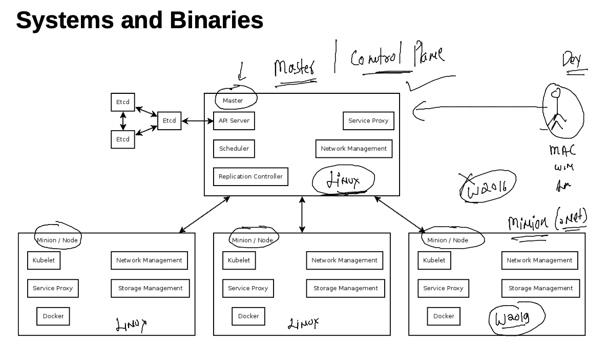
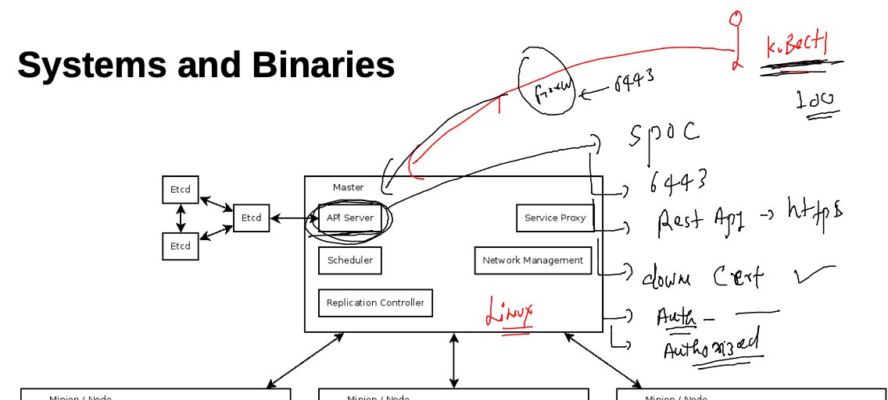
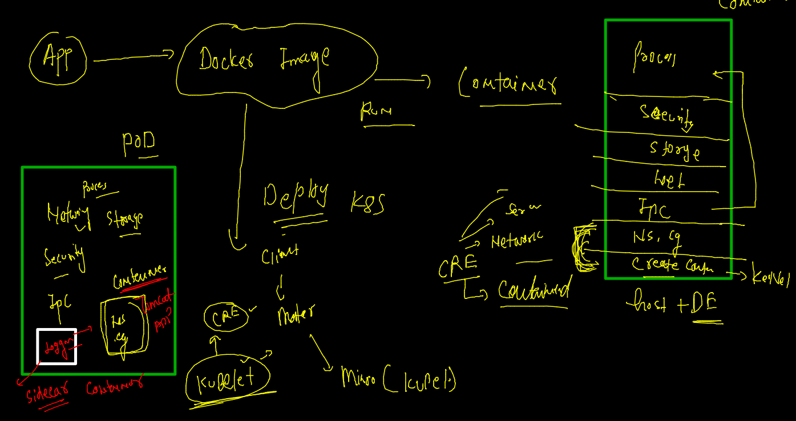
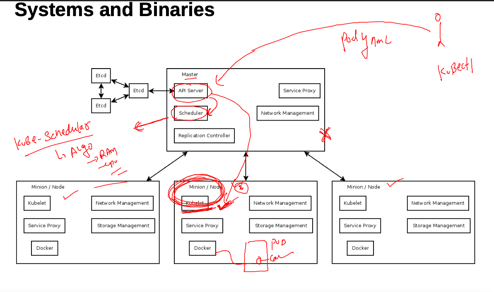
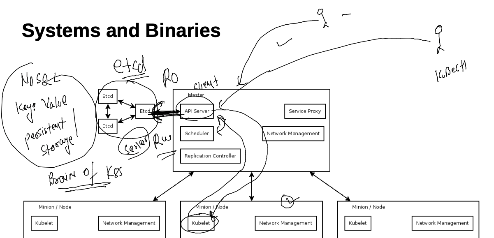
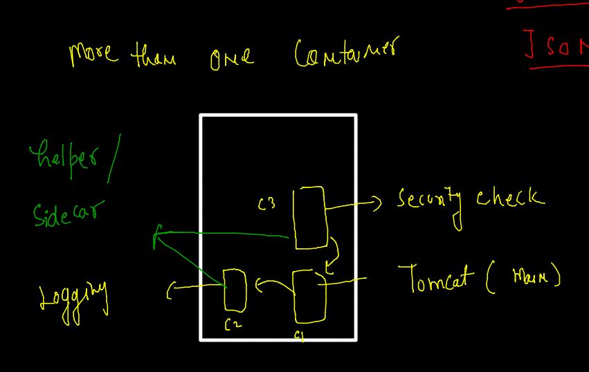

# Docker & Adv K8s

## Expectations 


### Plan 


### content 


## Revision 


### docker compose 


## configure Docker engine External storage 

```
 lsblk 
NAME          MAJ:MIN RM  SIZE RO TYPE MOUNTPOINT
nvme0n1       259:0    0    8G  0 disk 
|-nvme0n1p1   259:1    0    8G  0 part /
`-nvme0n1p128 259:2    0    1M  0 part 
nvme1n1       259:3    0  100G  0 disk 
[root@ip-172-31-95-144 docker]# mkfs.xfs /dev/nvme1n1 
meta-data=/dev/nvme1n1           isize=512    agcount=4, agsize=6553600 blks
         =                       sectsz=512   attr=2, projid32bit=1
         =                       crc=1        finobt=1, sparse=0
data     =                       bsize=4096   blocks=26214400, imaxpct=25
         =                       sunit=0      swidth=0 blks
naming   =version 2              bsize=4096   ascii-ci=0 ftype=1
log      =internal log           bsize=4096   blocks=12800, version=2
         =                       sectsz=512   sunit=0 blks, lazy-count=1
realtime =none                   extsz=4096   blocks=0, rtextents=0
[root@ip-172-31-95-144 docker]# mkdir   /mnt/docker 
[root@ip-172-31-95-144 docker]# mount  /dev/nvme1n1   /mnt/docker/
[root@ip-172-31-95-144 docker]# vim /etc/sysconfig/docker
[root@ip-172-31-95-144 docker]# systemctl daemon-reload 
[root@ip-172-31-95-144 docker]# systemctl restart docker 
[root@ip-172-31-95-144 docker]# df -h 
Filesystem      Size  Used Avail Use% Mounted on
devtmpfs        3.9G     0  3.9G   0% /dev
tmpfs           3.9G     0  3.9G   0% /dev/shm
tmpfs           3.9G  1.2M  3.9G   1% /run
tmpfs           3.9G     0  3.9G   0% /sys/fs/cgroup
/dev/nvme0n1p1  8.0G  2.6G  5.5G  33% /
tmpfs           785M     0  785M   0% /run/user/1001
tmpfs           785M     0  785M   0% /run/user/1000
/dev/nvme1n1    100G  135M  100G   1% /mnt/docker
[root@ip-172-31-95-144 docker]# vim /etc/fstab 
[root@ip-172-31-95-144 docker]# mount -a
[root@ip-172-31-95-144 docker]# cat  /etc/sysconfig/docker
# The max number of open files for the daemon itself, and all
# running containers.  The default value of 1048576 mirrors the value
# used by the systemd service unit.
DAEMON_MAXFILES=1048576

# Additional startup options for the Docker daemon, for example:
# OPTIONS="--ip-forward=true --iptables=true"
# By default we limit the number of open files per container
OPTIONS="--default-ulimit nofile=32768:65536 -g  /mnt/docker"

# How many seconds the sysvinit script waits for the pidfile to appear
# when starting the daemon.
DAEMON_PIDFILE_TIMEOUT=10

```

### Install docker compose on linux client host 

```
sudo curl -L "https://github.com/docker/compose/releases/download/1.29.2/docker-compose-$(uname -s)-$(uname -m)" -o /usr/local/bin/docker-compose
  % Total    % Received % Xferd  Average Speed   Time    Time     Time  Current
                                 Dload  Upload   Total   Spent    Left  Speed
100   664  100   664    0     0  34947      0 --:--:-- --:--:-- --:--:-- 34947
100 12.1M  100 12.1M    0     0  94.9M      0 --:--:-- --:--:-- --:--:-- 94.9M
[root@ip-172-31-95-144 docker]# sudo chmod +x /usr/local/bin/docker-compose
[root@ip-172-31-95-144 docker]# sudo ln -s /usr/local/bin/docker-compose /usr/bin/docker-compose
[root@ip-172-31-95-144 docker]# 

```

### checking compose 

```
docker-compose  -v
docker-compose version 1.29.2, build 5becea4c
[test@ip-172-31-95-144 ashutoshhcompose]$ 

```

### COmpsoe file example 1 

```
version: '3.8'
networks: # to create network 
 ashubr1: # name of bridge 
services:
 ashuapp1: # container 1 app info 
  image: alpine
  container_name: ashuc1
  command: ping fb.com 
  restart: always 
  networks: # using custom bridge 
  - ashubr1

 ashuapp2: # contianer 2 app info 
  image: dockerashu/ashuimages:dec14v1
  container_name: ashuc2 
  restart: no 
  networks: # using bridge 
  - ashubr1
  ports: # port forwardin like docker -p 1122:80 
  - "1122:80"


```


### run compose 

```
docker-compose up -d
Creating network "ashutoshhcompose_ashubr1" with the default driver
Pulling ashuapp1 (alpine:)...
latest: Pulling from library/alpine
59bf1c3509f3: Pull complete
Digest: sha256:21a3deaa0d32a8057914f36584b5288d2e5ecc984380bc0118285c70fa8c9300
Status: Downloaded newer image for alpine:latest
Pulling ashuapp2 (dockerashu/ashuimages:dec14v1)...
dec14v1: Pulling from dockerashu/ashuimages
b791d4160c6a: Pull complete
096f3738e919: Pull complete
cf87065a7d2e: Pull complete
Digest: sha256:0fa34296d50a47b827b768c44eaf9c17344704f8d6e44014da51d8b271f511c1
Status: Downloaded newer image for dockerashu/ashuimages:dec14v1
Creating ashuc1 ... done
Creating ashuc2 ... done
```

### COmpose more commands 

```
docker-compose  images
Container        Repository           Tag       Image Id       Size  
---------------------------------------------------------------------
ashuc1      alpine                  latest    c059bfaa849c   5.586 MB
ashuc2      dockerashu/ashuimages   dec14v1   a6cf50558313   399.3 MB
[test@ip-172-31-95-144 ashutoshhcompose]$ 
[test@ip-172-31-95-144 ashutoshhcompose]$ 
[test@ip-172-31-95-144 ashutoshhcompose]$ docker-compose  ps 
 Name         Command         State                  Ports                
--------------------------------------------------------------------------
ashuc1   ping fb.com          Up                                          
ashuc2   httpd -DFOREGROUND   Up      0.0.0.0:1122->80/tcp,:::1122->80/tcp
[test@ip-172-31-95-144 ashutoshhcompose]$ docker-compose  kill
Killing ashuc1 ... done
Killing ashuc2 ... done
[test@ip-172-31-95-144 ashutoshhcompose]$ docker-compose  ps
 Name         Command          State     Ports
----------------------------------------------
ashuc1   ping fb.com          Exit 137        
ashuc2   httpd -DFOREGROUND   Exit 137      

51  docker-compose up -d ashuapp1
   52  docker-compose  ps
   53  docker-compose  logs
```

### COmpose file runing 

```
docker-compose  -f webapp.yaml up -d
Creating network "ashutoshhcompose_default" with the default driver
Pulling mydatabase (mysql:)...
latest: Pulling from library/mysql
ffbb094f4f9e: Pull complete
df186527fc46: Pull complete
fa362a6aa7bd: Pull complete
5af7cb1a200e: Pull complete
949da226cc6d: Pull complete
bce007079ee9: Pull complete
eab9f076e5a3: Pull complete

```
### Container orchestration engine 

### SWARM -- Kubernetes -- openshift 

### swarm 


### SEtup swarm cluster 

### setup manager 

```
yum install docker -y 
systemctl start docker 

docker  swarm  init  --advertise-addr  172.31.93.32  
Swarm initialized: current node (49o4fez47g8awgabkevn5rcpl) is now a manager.

To add a worker to this swarm, run the following command:

    docker swarm join --token SWMTKN-1-3plo8d07a498t00jqh7q3vwamct1lxtzqwvbf7zlsycrshncye-2czabdpydv45yep8xajldvoul 172.31.93.32:2377

To add a manager to this swarm, run 'docker swarm join-token manager' and follow the instructions.

```

### to join worker insall docker and use above command 

### from Manager we can do things 

#### checking nodes 

```
docker  node  ls
ID                            HOSTNAME                       STATUS    AVAILABILITY   MANAGER STATUS   ENGINE VERSION
vvxcyfaqx40t5nemo6b3850j2     ip-172-31-82-94.ec2.internal   Ready     Active                          20.10.7
49o4fez47g8awgabkevn5rcpl *   ip-172-31-93-32.ec2.internal   Ready     Active         Leader           20.10.7
nac7kv3xgxj7nbkpo2fcbyfnq     ip-172-31-94-52.ec2.internal   Ready     Active                          20.10.7

```


### deploy any sample app in swarm 

```
docker  service  ls
ID        NAME      MODE      REPLICAS   IMAGE     PORTS
[root@ip-172-31-93-32 ~]# docker  service  create --name ashuwebapp -p 1155:80  dockerashu/ashuimages:dec14v1  
9wim8v1fk2hvml8ud4usber5p
overall progress: 1 out of 1 tasks 
1/1: running   [==================================================>] 
verify: Service converged 
[root@ip-172-31-93-32 ~]# docker  service  ls
ID             NAME         MODE         REPLICAS   IMAGE                           PORTS
9wim8v1fk2hv   ashuwebapp   replicated   1/1        dockerashu/ashuimages:dec14v1   *:1155->80/tcp
[root@ip-172-31-93-32 ~]# docker  service  ps  ashuwebapp
ID             NAME           IMAGE                           NODE                           DESIRED STATE   CURRENT STATE            ERROR     PORTS
rjs806l88nif   ashuwebapp.1   dockerashu/ashuimages:dec14v1   ip-172-31-93-32.ec2.internal   Running         Running 32 seconds ago             
[root@ip-172-31-93-32 ~]# docker node ls
ID                            HOSTNAME                       STATUS    AVAILABILITY   MANAGER STATUS   ENGINE VERSION
vvxcyfaqx40t5nemo6b3850j2     ip-172-31-82-94.ec2.internal   Ready     Active                          20.10.7
49o4fez47g8awgabkevn5rcpl *   ip-172-31-93-32.ec2.internal   Ready     Active         Leader           20.10.7
nac7kv3xgxj7nbkpo2fcbyfnq     ip-172-31-94-52.ec2.internal   Ready     Active                          20.10.7
[root@ip-172-31-93-32 ~]# 

```

### scaling app

```
 13  docker  service  create --name ashuwebapp -p 1155:80  dockerashu/ashuimages:dec14v1  
   14  docker  service  ls
   15  docker  service  ps  ashuwebapp
   16  docker node ls
   17  docker  service --help
   18  docker  service scale  --help
   19  docker  service scale  ashuwebapp=5
   20  docker  service  ls
   21  docker  service  ps  ashuwebapp
   22  history 
[root@ip-172-31-93-32 ~]# docker  service  ps  ashuwebapp
ID             NAME           IMAGE                           NODE                           DESIRED STATE   CURRENT STATE            ERROR     PORTS
rjs806l88nif   ashuwebapp.1   dockerashu/ashuimages:dec14v1   ip-172-31-93-32.ec2.internal   Running         Running 3 minutes ago              
n018y8cc6ble   ashuwebapp.2   dockerashu/ashuimages:dec14v1   ip-172-31-93-32.ec2.internal   Running         Running 49 seconds ago             
q8xqiv8rrnnu   ashuwebapp.3   dockerashu/

```

## K8s --- 

### hardware level arch 



### setup of k8s cluster Methods 


## kubeadm to setup cluster 

### youtube link 
[youtube:](https://www.youtube.com/watch?v=TTzbQdu30YA)


## K8s internal component Understanding 

### Master Node -- kube-apiserver 



### Master Node apiserver Certificates 


### connecting to k8s cluster using kubeconfig file --

```
kubectl  get  nodes   --kubeconfig admin.conf.txt 
NAME             STATUS   ROLES                  AGE   VERSION
controle-plane   Ready    control-plane,master   22m   v1.23.0
minion1          Ready    <none>                 21m   v1.23.0
minion2          Ready    <none>                 21m   v1.23.0

```

### COpy to config location 

```
cp -v admin.conf.txt  ~/.kube/config 
admin.conf.txt -> /Users/fire/.kube/config
 fire@ashutoshhs-MacBook-Air  ~/Desktop  
 fire@ashutoshhs-MacBook-Air  ~/Desktop  kubectl  get  nodes
NAME             STATUS   ROLES                  AGE   VERSION
controle-plane   Ready    control-plane,master   24m   v1.23.0
minion1          Ready    <none>                 23m   v1.23.0
minion2          Ready    <none>                 23m   v1.23.0

```

### POd intro duction 



### httpd app pod file 

```
apiVersion: v1 # master node apiversion for POD related details
kind: Pod 
metadata: # info about POD /kind 
 name: ashupod-123 # name pod 
spec: # info about app stack 
 containers: # container 
 - name: ashuc1 # name of container
   image: dockerashu/ashuimages:dec14v1 # image from Docker hub 
   ports: # app port 
   - containerPort: 80 
   
```

### checking syntax of YAML 

```
kubectl apply -f ashupod1.yaml --dry-run=client 
pod/ashupod-123 configured (dry run)
 fire@ashutoshhs-MacBook-Air  ~/Desktop/k8sapps  
```

### deploy YAML file 

```

kubectl apply -f ashupod1.yaml                  
pod/ashupod-123 created
 fire@ashutoshhs-MacBook-Air  ~/Desktop/k8sapps  kubectl  get  pods
NAME           READY   STATUS              RESTARTS   AGE
ashupod-123    1/1     Running             0          3s
harikapod1     0/1     ContainerCreating   0          0s
kiranpod-123   1/1     Running             0          5m9s

```

### kube-schedular 



### checking schedular info 

```
kubectl  describe  pod  ashupod-123  |  tail   
Node-Selectors:              <none>
Tolerations:                 node.kubernetes.io/not-ready:NoExecute op=Exists for 300s
                             node.kubernetes.io/unreachable:NoExecute op=Exists for 300s
Events:
  Type    Reason     Age    From               Message
  ----    ------     ----   ----               -------
  Normal  Scheduled  5m43s  default-scheduler  Successfully assigned default/ashupod-123 to minion2
  Normal  Pulled     5m41s  kubelet            Container image "dockerashu/ashuimages:dec14v1" already present on machine
  Normal  Created    5m41s  kubelet            Created container ashuc1
  Normal  Started    5m41s  kubelet            Started container ashuc1
  
```

### another method --

```
kubectl  get po -o wide
NAME            READY   STATUS    RESTARTS   AGE     IP                NODE      NOMINATED NODE   READINESS GATES
anilpod-123     1/1     Running   0          11m     192.168.34.6      minion1   <none>           <none>
ashupod-123     1/1     Running   0          6m41s   192.168.179.201   minion2   <none>           <none>
devipod-123     1/1     Running   0          7m39s   192.168.179.198   minion2   <none>           <none>
harikapod1      1/1     Running   0          12m     192.168.179.195   minion2   <none>           <none>
kiranpod-123    1/1     Running   0          17m     192.168.34.2      minion1   <none>           <none>
madhupod-123    1/1     Running   0          11m     192.168.34.7      minion1   <none>           <none>
phani1          1/1     Running   0          7m8s    192.168.179.200   minion2   <none>  

```

### Info about pod 

```
kubectl  get po ashupod-123  -o wide
NAME          READY   STATUS    RESTARTS   AGE     IP                NODE      NOMINATED NODE   READINESS GATES
ashupod-123   1/1     Running   0          7m40s   192.168.179.201   minion2   <none>           <none>
 fire@ashutoshhs-MacBook-Air  ~/Desktop  

```

### Persistent storage



### login to container inside POD 

```
kubectl  exec  -it ashupod-123 -- bash 
[root@ashupod-123 /]# cat /etc/os-release 
NAME="Oracle Linux Server"
VERSION="8.5"
ID="ol"
ID_LIKE="fedora"
VARIANT="Server"
VARIANT_ID="server"
VERSION_ID="8.5"
PLATFORM_ID="platform:el8"
PRETTY_NAME="Oracle Linux Server 8.5"
ANSI_COLOR="0;31"
CPE_NAME="cpe:/o:oracle:linux:8:5:server"
HOME_URL="https://linux.oracle.com/"
BUG_REPORT_URL="https://bugzilla.oracle.com/"

ORACLE_BUGZILLA_PRODUCT="Oracle Linux 8"
ORACLE_BUGZILLA_PRODUCT_VERSION=8.5
ORACLE_SUPPORT_PRODUCT="Oracle Linux"
ORACLE_SUPPORT_PRODUCT_VERSION=8.5
[root@ashupod-123 /]# exit
exit


```

### Deleting POD 

```
kubectl  delete pod ashupod-123
pod "ashupod-123" deleted
 fire@ashutoshhs-MacBook-Air  ~/Desktop  


```

### Deleting all the pods

```
kubectl delete pod --all
pod "anilpod-123" deleted
pod "devipod-123" deleted
pod "harikapod1" deleted
pod "kiranpod-123" deleted
pod "madhupod-123" deleted

```

### POD with more than one container 



### Auto generate pod YAML / JSOn using kubectl 

```
 8741  kubectl  run  ashupodx1  --image=dockerashu/ashuimages:dec14v1  --port=80      --dry-run=client  -o yaml 
 8742  kubectl  run  ashupodx1  --image=dockerashu/ashuimages:dec14v1  --port=80      --dry-run=client  -o yaml  >autogen.yaml
 8743  history
 8744  kubectl  run  ashupodx1  --image=dockerashu/ashuimages:dec14v1  --port=80      --dry-run=client  -o json 
 8745  kubectl  run  ashupodx1  --image=dockerashu/ashuimages:dec14v1  --port=80      --dry-run=client  -o json  >new.json
 
 ```
 
 ### 
 
 ```
 apiVersion: v1
kind: Pod
metadata:
  creationTimestamp: null
  labels:
    run: ashupodx1
  name: ashupodx1 # name of pod 
spec:
  nodeName: minion2 # static scheduling 
  containers:
  - image: alpine  # image from docker hub 
    name: ashucx1 # name of container 
    command: ["sh","-c","ping google.com"] # to set process 

  - image: dockerashu/ashuimages:dec14v1 # docker image 
    name: ashupodx1 # name of container 
    ports:
    - containerPort: 80
    resources: {}
  dnsPolicy: ClusterFirst
  restartPolicy: Always
status: {}

 
 ```


### Deploy pod 

```
kubectl  apply -f  autogen.yaml 
pod/ashupodx1 created
 fire@ashutoshhs-MacBook-Air  ~/Desktop/k8sapps  kubectl  get  pods
NAME         READY   STATUS              RESTARTS   AGE
ashupodx1    2/2     Running             0          8s
kiranpodx1   0/2     ContainerCreating   0          1s
 fire@ashutoshhs-MacBook-Air  ~/Desktop/k8sapps  kubectl  get  pods -o wide
NAME         READY   STATUS    RESTARTS   AGE   IP                NODE      NOMINATED NODE   READINESS GATES
ashupodx1    2/2     Running   0          29s   192.168.179.202   minion2   <none>           <none>

```

### access container shell

```
kubectl  exec -it ashupodx1 -- sh                Defaulted container "ashucx1" out of: ashucx1, ashupodx1
/ # 
/ # 
/ # exit

```

### checking logs of container 

```
 8761  kubectl logs ashupodx1
 8762  kubectl logs ashupodx1  ashucx1
 8763  history
 8764  kubectl logs ashupodx1
 8765  kubectl logs ashupodx1  ashupodx1
 
```


