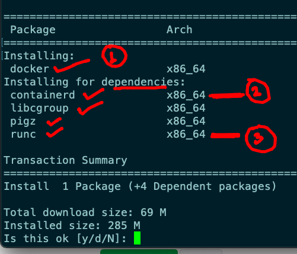
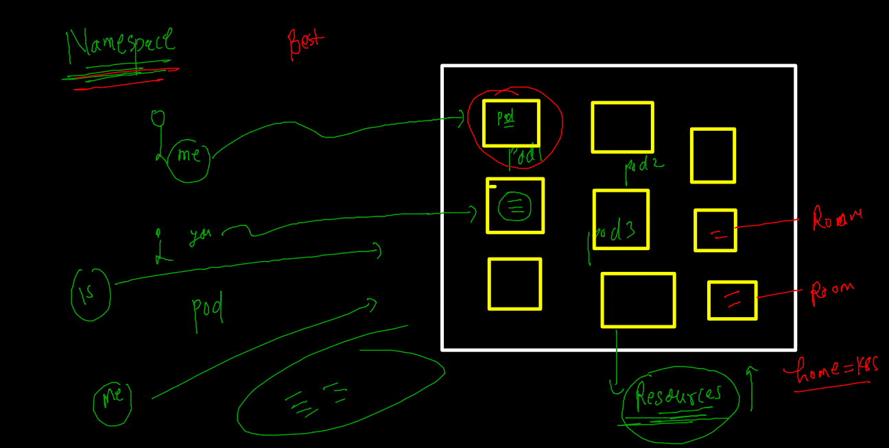
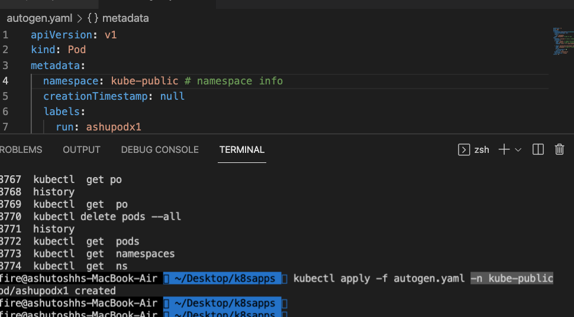

# Docker & Adv K8s

## Expectations 


### Plan 


### content 


### app stack in COntainers Now 


###  hypervisor in world 


### Containers in real world 


### CRE 


### Docker Installation 

```
yum install docker 
```


## Docker Ce setup steps 

### checking linux kernel version 

```
 whoami
root
[root@ip-172-31-82-225 ~]# uname 
Linux
[root@ip-172-31-82-225 ~]# uname  -r 
4.14.252-195.483.amzn2.x86_64
[root@ip-172-31-82-225 ~]# 

```

### Intsalling. docker ce docs 

[docs](https://docs.docker.com/engine/install/)




### RUNC 


### COnfiguration location of docker CE 


### Starting docker daemon / service 

```
# systemctl  start  docker  
[root@ip-172-31-82-225 docker]# systemctl  status  docker  
● docker.service - Docker Application Container Engine
   Loaded: loaded (/usr/lib/systemd/system/docker.service; disabled; vendor preset: disabled)
   Active: active (running) since Mon 2021-12-13 06:20:24 UTC; 3s ago
     Docs: https://docs.docker.com
  Process: 2888 ExecStartPre=/usr/libexec/docker/docker-setup-runtimes.sh (code=exited, status=0/SUCCESS)
  Process: 2871 ExecStartPre=/bin/mkdir -p /run/docker (code=exited, status=0/SUCCESS)
 Main PID: 2894 (dockerd)
    Tasks: 8
   Memory: 38.2M


```


### making docker service persistent 

```
 systemctl enable docker 
Created symlink from /etc/systemd/system/multi-user.target.wants/docker.service to /usr/lib/systemd/system/docker.service.

```

### Docker CLient side setup 


### Docker client to docker server connection details 


### COnfigure docker engine in TCP socket 


## FROM CLIENT sIDe 


### context create 

```
docker  context  create  mytestDE  --docker  host="tcp://54.227.229.82:2375"
mytestDE
Successfully created context "mytestDE"
 fire@ashutoshhs-MacBook-Air  ~  
 fire@ashutoshhs-MacBook-Air  ~  docker  context  ls
NAME                TYPE                DESCRIPTION                               DOCKER ENDPOINT                              KUBERNETES ENDPOINT                 ORCHESTRATOR
default *           moby                Current DOCKER_HOST based configuration   unix:///var/run/docker.sock                  https://127.0.0.1:60406 (default)   swarm
desktop-linux       moby                                                          unix:///Users/fire/.docker/run/docker.sock                                       
mytestDE            moby                                                          tcp://54.227.229.82:2375                                                         

```

### switching context 

```
docker  context use mytestDE 
mytestDE
 fire@ashutoshhs-MacBook-Air  ~  docker  context  ls          
NAME                TYPE                DESCRIPTION                               DOCKER ENDPOINT                              KUBERNETES ENDPOINT                 ORCHESTRATOR
default             moby                Current DOCKER_HOST based configuration   unix:///var/run/docker.sock                  https://127.0.0.1:60406 (default)   swarm
desktop-linux       moby                                                          unix:///Users/fire/.docker/run/docker.sock                                       
mytestDE *          moby                                                          tcp://54.227.229.82:2375                                                         


```


### DOcker/ container images 


## Docker Client supported operations 

### searching image 

```
docker  search  mysql 
NAME                              DESCRIPTION                                     STARS     OFFICIAL   AUTOMATED
mysql                             MySQL is a widely used, open-source relation…   11803     [OK]       
mariadb                           MariaDB Server is a high performing open sou…   4492      [OK]       
mysql/mysql-server                Optimized MySQL Server Docker images. Create…   885                  [OK]
percona                           Percona Server is a fork of the MySQL relati…   565       [OK]       
phpmyadmin                        phpMyAdmin - A web interface for MySQL and M…   391       [OK]       
centos/mysql-57-centos7           MySQL 5.7 SQL database server                   92                   
mysql/mysql-cluster               Experimental MySQL Cluster Docker images. Cr…   89                   
centurylink/mysql                 Image containing mysql. Optimized to be link…   59                   [OK]
databack/mysql-backup             Back up mysql dat

```

### pulling and checking images

```
docker  images
REPOSITORY   TAG       IMAGE ID   CREATED   SIZE
 fire@ashutoshhs-MacBook-Air  ~  
 fire@ashutoshhs-MacBook-Air  ~  docker  pull  ubuntu 
Using default tag: latest
latest: Pulling from library/ubuntu
7b1a6ab2e44d: Pull complete 
Digest: sha256:626ffe58f6e7566e00254b638eb7e0f3b11d4da9675088f4781a50ae288f3322
Status: Downloaded newer image for ubuntu:latest
docker.io/library/ubuntu:latest
 fire@ashutoshhs-MacBook-Air  ~  
 fire@ashutoshhs-MacBook-Air  ~  docker  pull  alpine 
Using default tag: latest
latest: Pulling from library/alpine
59bf1c3509f3: Pull complete 
Digest: sha256:21a3deaa0d32a8057914f36584b5288d2e5ecc984380bc0118285c70fa8c9300
Status: Downloaded newer image for alpine:latest
docker.io/library/alpine:latest
 fire@ashutoshhs-MacBook-Air  ~  
 fire@ashutoshhs-MacBook-Air  ~  
 fire@ashutoshhs-MacBook-Air  ~  docker  pull  openjdk 
Using default tag: latest
latest: Pulling from library/openjdk
28587b6e6475: Pull complete 
b1655352c888: Pull complete 
1f9646f00e96: Pull complete 
Digest: sha256:0e5ae79482731eef1526afb4e3a42e62b38142681c5752a944ff4236da979648
Status: Downloaded newer image for openjdk:latest
docker.io/library/openjdk:latest
 fire@ashutoshhs-MacBook-Air  ~  docker images
REPOSITORY   TAG       IMAGE ID       CREATED       SIZE
alpine       latest    c059bfaa849c   2 weeks ago   5.59MB
openjdk      latest    1b3756d6df61   3 weeks ago   471MB
ubuntu       latest    ba6acccedd29   8 weeks ago   72.8MB

```

### creating and list container 

```
8278  docker  run -d --name ashuc3  alpine ping localhost 
 8279  docker  ps
 fire@ashutoshhs-MacBook-Air  ~  docker  ps
CONTAINER ID   IMAGE           COMMAND                  CREATED              STATUS                  PORTS     NAMES
e08a42f871db   alpine:latest   "ping localhost"         2 seconds ago        Up Less than a second             sureshc2
6102d4c82bfc   alpine          "ping localhost"         27 seconds ago       Up 23 seconds                     ashuc3
4fd5dd0e3e2d   alpine:latest   "ping localhost"         33 seconds ago       Up 31 seconds                     haric1
a8752b0b0651   alpine          "ping localhost"         About a minute ago   Up 57 seconds      

```

### list of all type of containers 

```
docker  ps -a
CONTAINER ID   IMAGE           COMMAND                  CREATED              STATUS                          PORTS     NAMES
e2ff1acd6772   alpine          "ping localhost"         37 seconds ago       Up 34 seconds                             harikac2
fe006f9ab8f8   alpine:latest   "ping localhost"         59 seconds ago       Up 56 seconds                             sneha3
454fc2652be4   alpine          "ping localhost"         About a minute ago   Up 57 seconds                             phani1
c332606f2c6a   alpine:latest   "ping localhost"         About a minute ago   Up About a minute                         venuc1
e08a42f871db   alpine:latest   "ping localhost"         About a minute ago   Up About a minute                         sureshc2
6102d4c82bfc   alpine          "ping localhost"         About a minute ago   Up About a minute                         ashuc3
4fd5dd0e3e2d   alpine:latest   "ping localhost"         About a minute ago   Up About a minute                         haric1
3bab9dc4b2c6   alpine:latest   "ping goggle.com"        2 minutes ago        Exited (1) About a minute ago             sneha2
419d7391d8c0   alpine          "sh"                     2 minutes ago        Exited (0) 2 minutes ago                  prasun
a8752b0b0651   alpine          "ping localhost"         2 minutes ago        Up 2 minutes                              ashuc2
f3c0d0ad2e34   nginx:latest    "/docker-entrypoint.…"   3 minutes 

```

### checking resources consumption 

```
docker  stats 

CONTAINER ID   NAME       CPU %     MEM USAGE / LIMIT     MEM %     NET I/O      BLOCK I/O     PIDS
6e4c835e7197   ahuc12     0.01%     652KiB / 7.689GiB     0.01%     640B / 0B    0B / 0B       1
9f9dcb404719   anilc2     0.01%     680KiB / 7.689GiB     0.01%     640B / 0B    0B / 0B       1
a0d25b636488   ckkolla    0.01%     660KiB / 7.689GiB     0.01%     710B / 0B    0B / 0B       1
ab29dea0099a   neena1     0.01%     660KiB / 7.689GiB     0.01%     780B / 0B    0B / 0B       1
e2ff1acd6772   harikac2   0.01%     796KiB / 7.689GiB     0.01%     780B / 0B    0B / 0B       1
fe006f9ab8f8   sneha3     0.01%     708KiB / 7.689GiB     0.01%     850B / 0B    0B / 0B       1
454fc2652be4   phani1     0.01%     672KiB / 7.689GiB     0.01%     850B / 0B    0B / 0B       1
c332606f2c6a   venuc1   


```

### More containers operations 

```
 8290  docker  stop   ashuc3
 8291  docker  ps
 8292  docker  start  ashuc3
 8293  docker  ps
 fire@ashutoshhs-MacBook-Air  ~  docker  kill ashuc3 
ashuc3
 fire@ashutoshhs-MacBook-Air  ~  docker  rm  ashuc3
ashuc3


```

### Trick to create kill

```
 fire@ashutoshhs-MacBook-Air  ~  docker  ps  -q              
6e4c835e7197
9f9dcb404719
a0d25b636488
9adc83c213ee
e2ff1acd6772
fe006f9ab8f8
454fc2652be4
4fd5dd0e3e2d
a8752b0b0651
f3c0d0ad2e34
 fire@ashutoshhs-MacBook-Air  ~  docker kill $(docker  ps  -q)
6e4c835e7197
9f9dcb404719
a0d25b636488
9adc83c213ee
e2ff1acd6772
fe006f9ab8f8
454fc2652be4
4fd5dd0e3e2d
a8752b0b0651
f3c0d0ad2e34
 fire@ashutoshhs-MacBook-Air  ~  docker  ps
CONTAINER ID   IMAGE     COMMAND   CREATED   STATUS    PORTS     NAMES
 fire@ashutoshhs-MacBook-Air  ~  

```

### all non running container removing 

```
docker rm $(docker  ps  -aq)
6e4c835e7197
9f9dcb404719
a0d25b636488
ab29dea0099a
9adc83c213ee
e2ff1acd6772


```

### REMove docker image 

```
docker rmi  bbf6571db497  
Untagged: mysql:latest
Untagged: mysql@sha256:ff9a288d1ecf4397967989b5d1ec269f7d9042a46fc8bc2c3ae35458c1a26727
Deleted: sha256:bbf6571db4977fe13c3f4e6289c1409fc6f98c2899eabad39bfe07cad8f64f67
Deleted: sha256:a72da99dce60d6f8d4c4cffa4173153c990537fcdfaa27c35324c3348d55dd5c
Deleted: sha256:8b535d432ef2fbd45d93958347b2587c5cbe334f07d6909ad9d2d480ebbafb65
Deleted: sha256:14d13a3b33fc76839f156cd24b4636dab121e6d3d026cefa2985a4b89e9d4df8
Deleted: sha256:77c21a5a897a1ba752f3d742d6c94ee7c6b0e373f
```

## APp containerization {app-image--container}


### HTML frontend app Dockerfile 

#### CLone source code 

```

git clone  https://github.com/microsoft/project-html-website
Cloning into 'project-html-website'...
remote: Enumerating objects: 19, done.
remote: Total 19 (delta 0), reused 0 (delta 0), pack-reused 19
Unpacking objects: 100% (19/19), 462.61 KiB | 966.00 KiB/s, done.
 fire@ashutoshhs-MacBook-Air  ~/Desktop/dockerimages  ls
project-html-website

```
### building image

```
 cd  project-html-website 
 fire@ashutoshhs-MacBook-Air  ~/Desktop/dockerimages/project-html-website   master  ls
Dockerfile LICENSE    README.md  css        fonts      img        index.html
 fire@ashutoshhs-MacBook-Air  ~/Desktop/dockerimages/project-html-website   master  ls -a
.             .dockerignore Dockerfile    README.md     fonts         index.html
..            .git          LICENSE       css           img
 fire@ashutoshhs-MacBook-Air  ~/Desktop/dockerimages/project-html-website   master  docker build    -t  ashuhttpd:dec13app1  . 
Sending build context to Docker daemon  833.5kB
Step 1/6 : FROM oraclelinux:8.5
 ---> fa4253e97227
Step 2/6 : LABEL name="ashutoshh"
 ---> Running in 1ac7974fd596
Removing intermediate container 1ac7974fd596
 ---> 3d8cde119650
Step 3/6 : LABEL email="ashutoshh@linux.com"
 ---> Running in 2ec75c08012a
```

### checking image build history 

```
docker history  a6cf50558313
IMAGE          CREATED          CREATED BY                                      SIZE      COMMENT
a6cf50558313   4 minutes ago    /bin/sh -c #(nop)  CMD ["httpd" "-DFOREGROUN…   0B        
fb6fb2f27dfa   4 minutes ago    /bin/sh -c #(nop) COPY dir:7b42fcc269e12c20e…   822kB     
976210acaae1   7 minutes ago    /bin/sh -c yum  install httpd -y                163MB     
6e46d0deeb7a   16 minutes ago   /bin/sh -c #(nop)  LABEL email=ashutoshh@lin…   0B        
3d8cde119650   16 minutes ago   /bin/sh -c #(nop)  LABEL name=ashutoshh         0B        
fa4253e97227   3 weeks ago      /bin/sh -c #(nop)  CMD ["/bin/bash"]            0B        
<missing>      3 weeks ago      /bin/sh -c #(nop) ADD file:4e55964bdaba265f1…   235MB     
 fire@ashutoshhs-MacBook-Air  ~  docker images


```

### creating container from image 

```
docker run  -d  --name ashuwebc1  ashuhttpd:dec13app1  
ba13153b3c48058c4fd806e2e8a6fe13ba0dc2cc1223de6fe2d77b0d712e3fd3
 fire@ashutoshhs-MacBook-Air  ~  docker  ps
CONTAINER ID   IMAGE                 COMMAND                CREATED         STATUS         PORTS     NAMES
ba13153b3c48   ashuhttpd:dec13app1   "httpd -DFOREGROUND"   6 seconds ago   Up 2 seconds             ashuwebc1
 fire@ashutoshhs-MacBook-Air  ~  

```
###  Namespaces 



### namespace more 




